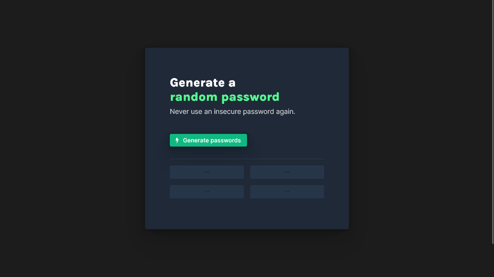

# Scrimba - Random password generator solution

This is a solution to the [Random password generator project on Scrimba](https://scrimba.com/learn/learnjavascript/). Scrimba helps you improve your coding skills by building realistic projects.

## Table of contents

- [Overview](#overview)
  - [The challenge](#the-challenge)
  - [Screenshot](#screenshot)
  - [Links](#links)
- [My process](#my-process)
  - [Built with](#built-with)
  - [What I learned](#what-i-learned)
  - [Continued development](#continued-development)
  - [Useful resources](#useful-resources)
- [Author](#author)
- [Acknowledgments](#acknowledgments)

## Overview

### The challenge

Users should be able to:

- Generate 4 passwords by 12 characters clicking on the button

### Screenshot



### Links

- Solution URL: [@GitHub](https://github.com/xdelmo/random-password-generator)
- Live Site URL: [@GitHub](https://htmlpreview.github.io/?https://github.com/xdelmo/random-password-generator/blob/master/index.html)

## My process

### Built with

- Semantic HTML5 markup
- CSS custom properties
- Flexbox
- CSS Grid Layout
- Mobile-first workflow
- Vanilla Javascript

### What I learned

With this project I improved my CSS and JS skills. The newest things I learnt are:

- How to create a responsive grid made up of 2 columns and 2 rows of the same dimensions

```css
.downSection {
  display: grid;
  grid-template-columns: repeat(2, 1fr);
  grid-template-rows: repeat(2, 1fr);
  gap: 1em;
}

@media (max-width: 520px) {
  .downSection {
    grid-template-columns: 1fr;
    grid-template-rows: repeat(4, 1fr);
  }
}
```

- How to store all elements with same class in a variable and how to change their CSS styles via Javascript

```js
// Creates a function changeColorPasswords() that changes color to passwords
function changeColorPasswords() {
  // Gets and stores all elements with generatedPassword class in allPassword variable
  let allPasswords = document.getElementsByClassName("generatedPassword");
  // Changes color to var(--clr-bright-green) for every passwords in allPasswords
  for (let i = 0; i < allPasswords.length; i++) {
    allPasswords[i].style.color = "var(--clr-bright-green)";
  }
}
```

### Continued development

I'd like to:

- Implement the ability to set the password length
- Add 1-click copy password to the clipboard

### Useful resources

- [Fontawesome](https://fontawesome.com/v4/)&[W3Schools](https://www.w3schools.com/icons/tryit.asp?filename=tryicons_fa-flash) - How to implement nice icons to the project
- [How to change hr's thickness](https://stackoverflow.com/questions/4151743/how-can-i-change-the-thickness-of-my-hr-tag) - This helped me to understand how hr tag works
- [Stackoverflow](https://stackoverflow.com/questions/44573859/a-loop-to-create-the-alphabet-using-javascrip) - Good question to convert numbers to aplhabet's letters
- [CSS Grid generator](https://cssgrid-generator.netlify.app/) - Wonderful tool to create simple grid in 4 clicks
- [Codecademy](https://discuss.codecademy.com/t/changing-background-color-with-class/385183) - How to store elements with same CSS class in a variable and how to change their CSS styles via Javascript

## Author

- Website - [Emanuele Del Monte](https://www.emanueledelmonte.it)
